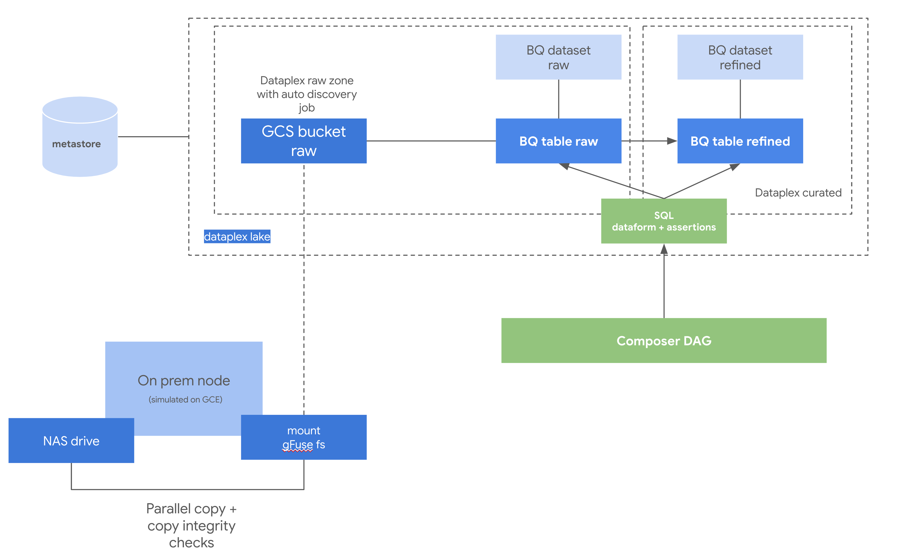

# GCP Ingestion framework - Batch file ingestion onprem to BigQuery

## Introduction

This repository contains an opinionated implementation of a simple GCP Batch On prem File to BigQuery Data ingestion Solution.
It uses the following GCP components:

* [**Cloud Storage**](https://cloud.google.com/storage) + [**Cloud Storage FUSE**](https://cloud.google.com/storage/docs/gcs-fuse) - For data uploading to a landing GCS bucket. GCS FUSE is an adapter that allows you to mount Cloud Storage buckets as file systems on Linux or macOS systems. It also provides a way for applications to upload and download Cloud Storage objects using standard file system semantics. Supported formats are: CSV, JSON and PARQUET
* [**Dataplex**](https://cloud.google.com/dataplex) - for landing area GCS data auto discovery and automatic registration of BigQuery external tables - including automatic schema detection.
* [**Dataform**](https://cloud.google.com/dataform) - for reading the BigQuery landing external tables, perform quality checks and materialize the tables inside BigQuery using native storage.
* [**Composer**](https://cloud.google.com/composer) - for triggering the previous dataform jobs on a fixed schedule of after an particular event is triggered (e.g. new files on bucket)


## Ingestion Workflow

1. On a local node on your datacenter, a bucket is mounted using GCS FUSE. This node has also access to a NAS/SAN filesystem. 


2. Data is copied in paralell from the SAN/NAS to the GCS FUSE filesystem using standard OS tools. A requirement of this framework is that the data layout should conform to the [HIVE directory partitioned layout](https://cloud.google.com/bigquery/docs/hive-partitioned-queries-gcs#supported_data_layouts). Supported file formats are JSON,CSV,AVRO,ORC and PARQUET.
3. The mounted bucket is under a dataplex RAW Zone with a discovery job configured, so once the bucket is scanned, new external tables will be registered at BigQuery automatically.
4. Finally, a Composer DAG calls a dataform job, that reads the external BQ table, applies certain validations and write into another BigQuery dataset, this time as an internal table.


## Installation

From the local machine, open a terminal:
- Clone this repository:
```bash
$>  git clone https://github.com/velascoluis/gcp-ingestion-framework.git
```
- Navigate to `gcp-ingestion-framework/src/terraform/scripts-hydrated/` and execute:
```bash
$> mount_gcs_bucket_local.sh <gcp_project_id> <gcp_bucket> <path>
```
- Copy files from your SAN/NAS to the GFUSE mounted filesystem


From GCP (Cloud Shell):
- Clone this repository:

```bash
git clone https://github.com/velascoluis/gcp-ingestion-framework.git
```

- Navigate to `gcp-ingestion-framework/src/terraform` and execute:
```bash
$> local_project_launcher.sh.sh <gcp_project_id> <gcp_region> <gcp_zone> <gcp_user_id>
```
This step will deploy all the required components on your project, it should take around 30 minutes.

## Usage

Trigger the Composer DAG


## Architecture

